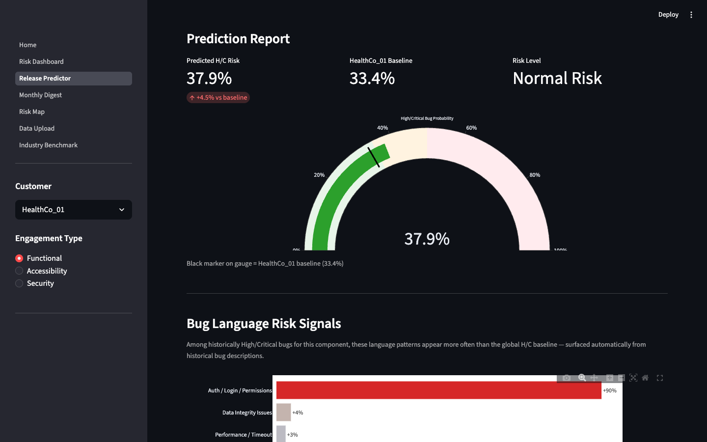
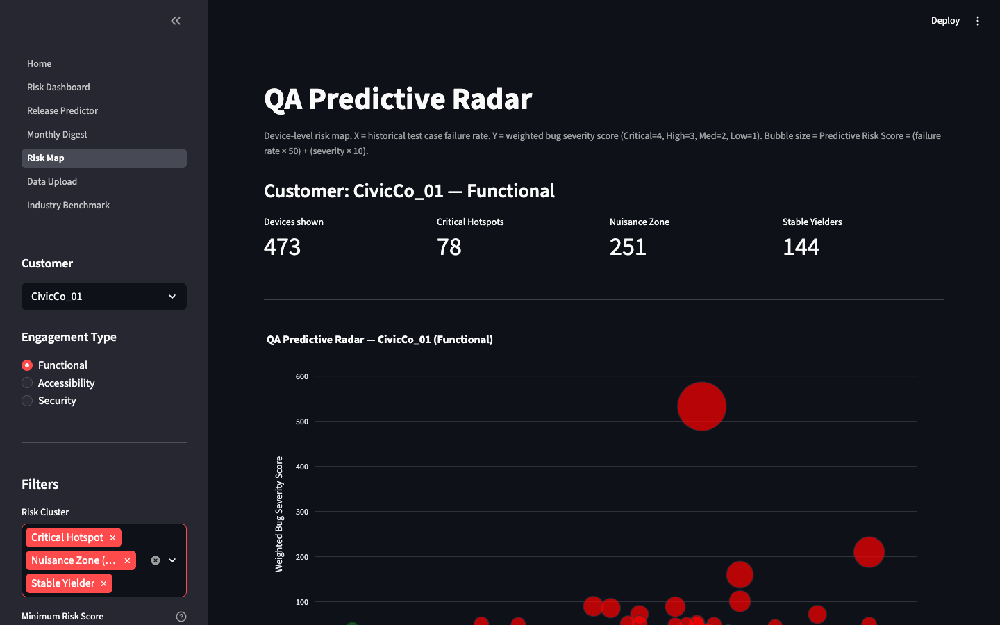
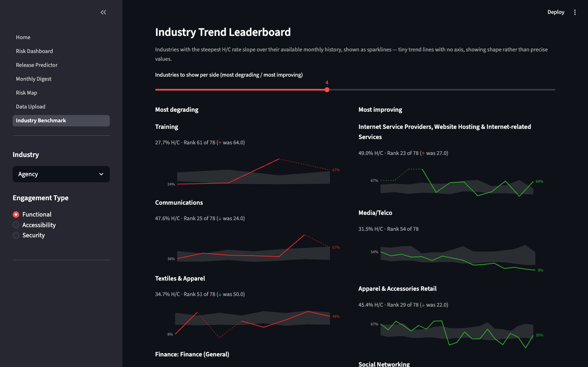

# Apogee — Release Risk Intelligence

Software QA teams accumulate years of bug and test-cycle history but rarely use it predictively — severity gets assessed release by release, from instinct and a spreadsheet, with no memory of which components, devices, or platforms have actually been risky over time. Apogee turns that history into a forecast: given an upcoming release's component, platform, and testing context, it predicts the probability of a Critical/High-severity bug, ranks the specific risk factors driving that prediction, and — at the device level — flags which (customer, device, engagement-type) combinations are actually worth QA investment versus which are noise. It's engineered to match real-world enterprise quality benchmarks — severity distributions, component mixes, and failure patterns — spanning a simulated roster of 300+ organizations across over 80 industries.

## Architecture

A binary RandomForest classifier (`is_high_crit`: Critical/High vs. Medium/Low severity) trained on four feature streams:

- **Structural** — App Component, Platform, Development Stage, Testing Approach, Bug Source Type, Industry, plus numeric fields like bug rate and test-cycle duration.
- **Text signal** — seven keyword-flag categories (crash, security, performance, access, …) matched against bug subject/result text, backed by TF-IDF/SVD topics, with optional sentence-transformer embeddings as a heavier third layer when installed.
- **Latent risk archetypes** — NMF factorization over entity co-occurrence (component × platform × dev-stage × testing-approach × source-type × customer), surfacing risk patterns no single categorical field captures alone.
- **Network structure** — a property graph over components, platforms, and customers, contributing PageRank, degree centrality, and clustering coefficient as features. A component that's structurally central to many high-risk platforms carries more weight than its raw bug count alone would suggest.

Six Streamlit views sit on top of the trained artifacts:

| View | What it shows |
|------|-------------|
| **Risk Dashboard** | Ranked H/C rate by component, platform, environment, and testing approach; model-wide feature importances; a risk network graph of structurally connected high-risk entities. |
| **Release Predictor** | Form-driven prediction — describe an upcoming release, get an H/C probability scored against the customer's own baseline, a component-risk breakdown, and language-based risk signals from historical bug text. |
| **Monthly Digest** | Month-over-month H/C rate trend, bug-language keyword trends, all-time top risk areas. |
| **Risk Map** | Device-level bubble chart (see Design decisions below) sorting (customer, device, engagement-type) combinations into four investment-priority clusters. |
| **Industry Benchmark** | Cross-customer comparison by industry — fix-verification closure rate, rejection rate, works-as-designed share, coverage gap score, peer-percentile trend bands, and a trend-slope leaderboard of degrading/improving industries. |
| **Data Upload** | Upload refreshed Excel exports and retrain in one step, no CLI needed. |

Every view is scoped to a selected Customer + Engagement Type (Functional / Accessibility / Security are run by different teams and tracked separately; Usability engagements are excluded — they produce interviews and surveys, not bugs).

## Screenshots

*(captured from a local `streamlit run` — see Quickstart)*





## Design decisions

**Device-anchored prediction, not just customer-level.** Risk Map deliberately aggregates at (Customer, Device, Engagement Type), not just Customer. Fragmentation — a specific OS version, a specific device model — is often the actual root cause of QA risk, and that signal disappears if you only ever roll up to the customer or platform level. Anchoring at the device tells a team *which physical devices* are driving their failure rate, not just that their app has "device issues" in the abstract.

**Severity weighting over raw bug counts.** A device with twenty low-severity cosmetic bugs and a device with two crashes are not equally risky, but a naive bug-count ranking treats them the same. Risk Map instead computes a `Severity_Index` (Critical=4, High=3, Medium=2, Low=1, summed) and a `Predictive_Risk_Score` (`failure_rate × 50 + severity_index × 10`), so ranking reflects actual risk exposure rather than ticket volume. The same instinct — severity, not count, is the signal — is why the core classifier's target is a severity-tier flag (`is_high_crit`) rather than a raw bug-count regression.

**Four optimization clusters, not a single risk score.** Collapsing everything to one number loses the distinction between "worth fixing" and "worth ignoring." Risk Map instead buckets every device combination into one of four fixed-threshold clusters — **Critical Hotspot** (high failure rate, high severity — fix now), **Nuisance Zone** (high failure rate, low severity — probably a flaky test or a cosmetic issue), **Low ROI** (zero bugs, zero failures — deprioritize further testing here), **Stable Yielder** (everything else, the baseline). The clusters are a resource-allocation tool: they answer "where should QA effort actually go," which a single blended score can't.

## Quickstart

Clone and run — the repo ships with a modeled dataset engineered to match real-world QA structure (severity distributions, component mixes, device failure rates, dates, and testing approaches).

```bash
git clone <this-repo>
cd apogee
pip install -r requirements.txt

python model/train.py       # trains on data/, writes model/artifacts/ (few minutes)
streamlit run app/Home.py   # http://localhost:8501
```

`sentence-transformers` is optional and left out of `requirements.txt` (heavy, unnecessary for Streamlit Cloud deployment). If it's installed locally, `train.py` picks it up automatically for semantic text embeddings; otherwise it falls back to keyword flags + TF-IDF/SVD only, which is what the shipped artifacts were trained on.

To retrain against your own data instead: replace the files in `data/` with same-schema exports (see `EXPECTED_DATA_FILES` in `config.py`), or upload them from the in-app **Data Upload** page. Uploading a subset is fine — only the matching files get replaced.

## Project structure

```
apogee/
├── data/               # Training data (bug details, test cycles, device runs, test cases, entitlements)
├── model/
│   ├── train.py         # Training pipeline — multi-modal feature build + classifier + risk tables
│   ├── predict.py        # Inference module used by the app
│   └── artifacts/        # Saved model files (generated by train.py)
├── app/
│   ├── Home.py           # Streamlit entry point
│   ├── utils.py          # Shared Customer + Engagement Type sidebar selector
│   └── pages/             # The six views listed above
├── config.py            # Shared paths, feature definitions, engagement-type rules
└── requirements.txt
```
